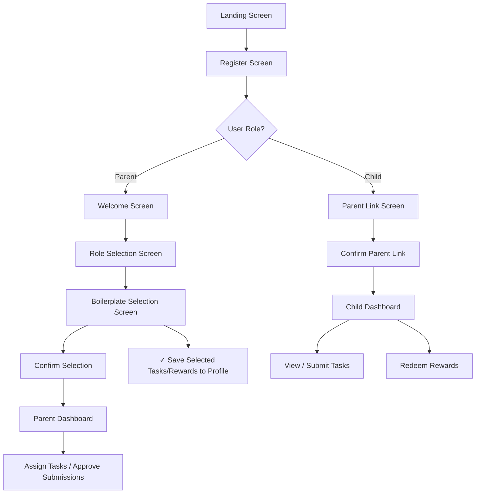

# 📱 EarnIt App – User Flow Overview

This document outlines the onboarding and navigation flow for both **Parent** and **Child** users in the EarnIt mobile app.

---

## 🔰 Entry Point

**LandingScreen**
- CTA: “Join Early Access” → navigates to `RegisterScreen`

---

## 📝 Registration Flow

**RegisterScreen**
- Inputs: Name, Email, Password, Role (Parent or Child)
- On Success:
  - If **Parent** → navigates to `WelcomeScreen`
  - If **Child** → navigates to `ParentLinkScreen`

---

## 👨‍👧 Parent Onboarding Flow

```text
WelcomeScreen
   ↓****
RoleSelectionScreen  (→ Parent selected)
   ↓
BoilerplateSelectionScreen
   ↓
ConfirmSelectionScreen
   ↓
ChildSetupScreen
   ↓
ParentDashboard
```

## Child Onboarding Flow
```text
WelcomeScreen
   ↓
RoleSelectionScreen  (→ Child selected)
   ↓
ParentLinkScreen  (enter Parent ID)
   ↓
ConfirmLinkScreen
   ↓
ChildDashboard
```

<!-- <details>
<summary>Click to Expand</summary> -->

<!-- </details> -->